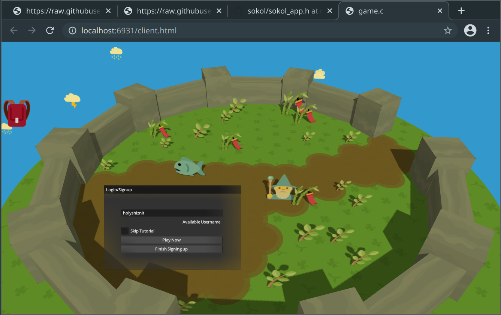
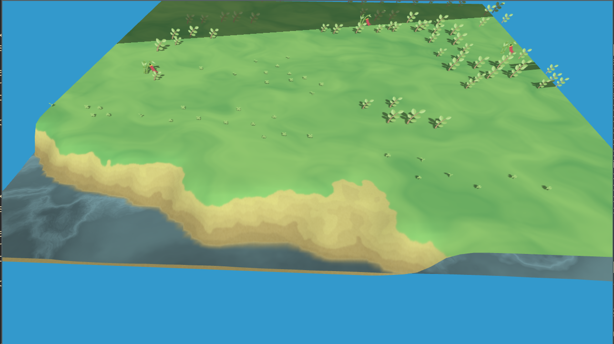

# game

A game written in C99 with minimal dependencies for Windows, macOS, Linux and WASM.




## Clone, Build and Run (Linux, macOS, Windows)

On the command line:

```
git clone https://github.com/usr/repo
cd repo
mkdir build
cd build
cmake ..
cmake --build .
```

> NOTE: on Linux you'll need to install the OpenGL and X11 development packages (e.g. mesa-common-dev and libx11-dev).

On Mac and Linux this will create an executable called 'game'
in the build directory:

```
./game
```

On Windows, the executable is in a subdirectory:

```
Debug/game.exe
```

## Build and Run WASM/HTML version via Emscripten

> NOTE: You'll run into various problems running the Emscripten SDK tools on Windows, might be better to run this stuff in WSL.

Setup the emscripten SDK as described here:

https://emscripten.org/docs/getting_started/downloads.html#installation-instructions

Don't forget to run ```source ./emsdk_env.sh``` after activating the SDK.

And then in the game.c directory:

```
mkdir build
cd build
emcmake cmake -G"Unix Makefiles" -DCMAKE_BUILD_TYPE=MinSizeRel ..
cmake --build .
```

To run the compilation result in the system web browser:

```
> emrun game.html
```

## IDE Support

On Windows, cmake will automatically create a **Visual Studio** solution file which can be opened with the ```start``` command:
```
cd build
cmake ..
start game.sln
```

On macOS, the cmake **Xcode** generator can be used to create an
Xcode project which can be opened with the ```open``` command:
```
cd build
cmake -GXcode ..
open game.xcodeproj
```

On all platforms with **Visual Studio Code** and the Microsoft C/C++ and
CMake Tools extensions, simply open VSCode in the root directory of the
project. The CMake Tools extension will detect the CMakeLists.txt file and
take over from there:
```
cd game.c
code .
```
